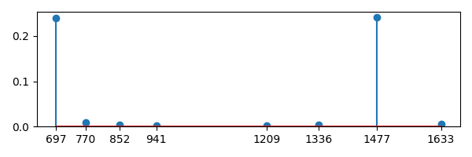

# Goertzel算法

如果只想获得某个或某几个频率点的频谱值，用FFT就有点大材小用了，这时可以直接使用DFT的公式来计算，或者采用比DFT更快的Goertzel算法。

## 理论

从DFT的定义出发开始推导。利用旋转因子的性质，有

$$
\begin{flalign}
& X[k] = \sum_{n=0}^{N-1}x[n]W_{N}^{kn} = \sum_{n=0}^{N-1}x[n]W_{N}^{-k(N-n)}  &
\end{flalign}
$$

上式右端很像是某种卷积形式，考虑卷积式$y_k[m] = x[m] \ast h_k[m]$，其中$h_k[m] = W_{N}^{-km}u[m]$，则

$$
\begin{flalign}
& y_k[m] = x[m] \ast h_k[m] = \sum_{n = -\infty}^{\infty}x[n]h_k[m-n] = \sum_{n=-\infty}^{\infty}x[n]W_{N}^{-k(m-n)}u[m-n] &
\end{flalign}
$$

当$m=N$时，并考虑$x[n]$只在$[0, N-1]$有值，则

$$
\begin{flalign}
& y_k[N] = \sum_{n=0}^{N-1}x[n]W_{N}^{-k(N-n)}&
\end{flalign}
$$

正好有$y_k[N] = X[k]$。就是说信号某个频率点的频谱值可以把原始信号通过单位冲激响应为$h_k[m]$的LTI系统得到。对$h_k[m]$进行z变换：

$$
\begin{flalign}
& H_k(z) = \frac{1}{1 - W_{N}^{-k}z^{-1}} = \frac{Y_k(z)}{X(z)} &
\end{flalign}
$$

根据上式写出差分方程如下，根据这个方程已经可以计算指定频率点的频谱值了。

$$
\begin{flalign}
& y_k[n] = W_N^{-k}y_k[n-1] + x[n] &
\end{flalign}
$$

如果对$H_k(z)$增加一个共轭极点，则

$$
\begin{flalign}
H_k(z) &= \frac{1}{1 - W_{N}^{-k}z^{-1}} \cdot \frac{1-W_{N}^{k}z^{-1}}{1-W_{N}^{k}z^{-1}} & \\
       &= \frac{1-W_{N}^{k}z^{-1}}{1-2\cos(2\pi k / N)z^{-1} + z^{-2}} &
\end{flalign}
$$

将$H_k(z)$看成是两个系统的级联，则有$H_k(z) = H_1(z) \cdot H_2(z)$，其中

$$
\begin{flalign}
& H_1(z) = \frac{V_k(z)}{X(z)} = \frac{1}{1-2\cos(2\pi k / N)z^{-1} + z^{-2}} & \\
& H_2(z) = \frac{Y_k(z)}{V_k(z)} = 1-W_{N}^{k}z^{-1} &
\end{flalign}
$$

根据上式很容易写出如下的差分方程，通过简单分析很容易知道下式比DFT和FFT计算某频率点的频谱具有更高的效率。

$$
\begin{flalign}
v_k[n] &= x[n] + 2\cos(2\pi k / N)v_k[n-1] - v_k[n-2] & \\
y[n]   &= v_k[n] - W_N^kv_k[n-1] &
\end{flalign}
$$

## 实现

```python
import numpy as np
import scipy.io.wavfile as wav
import matplotlib.pyplot as plt


fs, x = wav.read('./goertzel-dtmf_3.wav')
N = len(x)
multi = np.array([697, 770, 852, 941, 1209, 1336, 1477, 1633])
index = N * multi / fs + 0.5
index = index.astype(np.int32)

y = []
for k in index:
    cosine = np.cos(2 * np.pi * k / N)

    v1, v2 = 0, 0
    for n in range(N):
        v0 = x[n] + 2 * cosine * v1 - v2
        v2 = v1
        v1 = v0

    y.append(v0 - np.exp(-1j * 2 * np.pi / N * k) * v2)

y = np.abs(y) * 2 / N

plt.figure(figsize=(6, 2), dpi=100)
plt.stem(multi, y)
plt.xticks(ticks=multi, labels=[str(f) for f in multi])
# plt.xlabel("(Hz)")
plt.ylim(bottom=0.0)
plt.tight_layout()
plt.savefig("./goertzel-dtmf.png", transparent=True)
plt.show()

print(multi[y > y.mean()])
```



## 应用

Goertzel最经典的应用就是在DTMF的检测上。核心算法见上面的算例，实践中还有许多细节。比如为了区分开拨号音与乐音，还要检测DTMF频率的二次谐波。通常情况下正弦波的二次谐波的幅值应该是非常小的，如果二次谐波很大，则认为不是DTMF信号。

## References

<https://www.embedded.com/the-goertzel-algorithm/>
