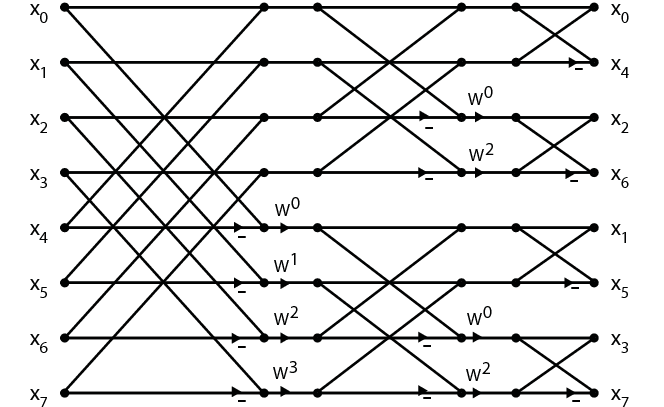

# Fast Fourier Transform Radix 2

## Discrete Fourier Transform

FFT是DFT的快速算法，DFT就是施加在$N$点离散序列上的一种运算。DFT的定义见下式。因为旋转因子$W_N^k$的周期性，$X[k]$也隐含一种周期性，所以只需计算前$N$点的$X[k]$就可以了。根据DFT的计算公式不难看出，其时间复杂度为$O(n^2)$。

$$
\begin{flalign}
& X[k] = \sum_{n=0}^{N-1}x[n]W_N^{nk}, \quad \text{其中} W_N = {\rm e}^{-{\rm j} {2\pi / N}} &
\end{flalign}
$$

## Fast Fourier Transform Radix 2

### Decimation in Time (DIT)

将上面DFT的公式按照$x[n]$下标分成两组，下标0,2,4,6,...的一组，下标1,3,5,7,...的一组，则原来$N$点的DFT变成了两个$N/2$点的DFT问题。每个$N/2$点的DFT问题又可以拆成两个$N/4$点的DFT问题，如此下去就变成了时间复杂度为$O(n \log n)$的FFT。

$$ \begin{flalign}
X[k] &= \sum_{n=0}^{N-1}x[n]W_N^{nk} &\\
	 &= \sum_{r=0}^{N/2-1} x[2r]W_N^{2rk} + \sum_{r=0}^{N/2-1} x[2r+1]W_N^{(2r+1)k} \\
	 &= \sum_{r=0}^{N/2-1} x[2r]W_{N/2}^{rk} + W_N^k \sum_{r=0}^{N/2-1} x[2r+1]W_{N/2}^{rk} \\
\end{flalign} $$

对$X[k]$的前一半有$k_0 \in [0, N/2)$，所以

$$ \begin{flalign}
& X[k_0] = \sum_{r=0}^{N/2-1} x[2r]W_{N/2}^{rk_0} + W_N^{k_0} \sum_{r=0}^{N/2-1} x[2r+1]W_{N/2}^{rk_0} &
\end{flalign} $$

对$X[k]$的后一半有$k_1 = k_0 + N/2 \in [N/2, N)$，所以

$$ \begin{flalign}
X[k_1] = X[k_0 + N/2] &= \sum_{r=0}^{N/2-1} x[2r]W_{N/2}^{r(k_0+N/2)} + W_N^{(k_0+N/2)} \sum_{r=0}^{N/2-1} x[2r+1]W_{N/2}^{r(k_0+N/2)} &\\
					  &= \sum_{r=0}^{N/2-1} x[2r]W_{N/2}^{rk_0} - W_N^{k_0} \sum_{r=0}^{N/2-1} x[2r+1]W_{N/2}^{rk_0} &
\end{flalign} $$

#### Implementation

##### Recursion

根据上面的介绍很容易写出FFT的递归实现

```python
import numpy as np


def dit_fft_recursion(x):
    n = len(x)

    if n == 1:
        return x

    y0 = dit_fft_recursion(x[0::2])
    y1 = dit_fft_recursion(x[1::2])

    w = np.exp(-1j * 2 * np.pi / n * np.arange(0, n // 2))

    y = np.zeros(n, dtype=complex)
    y[:n//2], y[n//2:] = y0 + w * y1, y0 - w * y1

    return y
```

##### Iteration

一个算法如果写成迭代形式，运行效率会进一步提高。迭代形式的FFT一般画成蝶形图来帮助理解。下图是网上随便找的一张基于时间抽取的8点FFT蝶形图。


注意，上图中输入数据$x[n]$的顺序是根据下标重排了之后的。重排的方法就是对每组数据把下标为偶数的抽出来放到前面，下标为奇数的放到后面，这可以从前文FFT原理介绍的部分看出来。对一个8点序列$(x[0],\, x[1],\, x[2],\, x[3],\, x[4],\, x[5],\, x[6],\, x[7],\, x[8])$，经过一轮重排之后变成了两个4点的序列，分别是$(x[0],\, x[2],\, x[4],\, x[6])$和$(x[1],\, x[3],\, x[5],\, x[7])$。对这两个4点序列分别按照下标的奇偶再进行一轮重排，得到了四个2点的序列，$(x[0],\, x[4])$，$(x[2],\, x[6])$，$(x[1],\, x[5])$，$(x[3],\, x[7])$，下图或许能表示的更清楚。


则迭代版本的FFT算法实现如下面的代码段所示。

```python
import numpy as np


def dit_fft_iteration(x):
    def array_rearange(x):
        if len(x) == 2:
            return x

        x0 = array_rearange(x[0::2])
        x1 = array_rearange(x[1::2])

        return np.concatenate((x0, x1))

    x = array_rearange(x)
    x = np.array(x, dtype=complex)

    N = len(x)

    W = np.exp(-1j * 2 * np.pi / N * np.arange(N // 2))

    L = int(np.log2(N))
    for i in range(L):
        M = int(2 ** (i + 1))
        WN = W[::N//M]

        for k in range(0, N, M):
            x0, x1 = x[k: k + M//2], x[k + M//2: k+M]
            x[k: k + M//2], x[k + M//2: k + M] = x0 + x1 * WN, x0 - x1 * WN

    return x
```

##### Bit Reverse

上面实现中输入数据下标重排的部分是递归实现的，典型的分治策略，其时间复杂度为$O(n \log n)$。还有一种基于码位倒序的实现，可以将时间复杂度降低到$O(n)$。


###### Hardware Solution

仔细观察重排之后的数据的二进制表示，在每个数字的最左边的bit位上加1并向右进位，这样就得到了下一个数字。这种方法用软件实现起来有点繁，但用硬件来实现就比较容易了。几乎每一款DSP都有为了FFT算法的倒序寻址指令。

###### Software Solution

如上图所示的8点FFT，重排之后的二进制表示正好是重排之前二进制表示的左右翻转。对一个二进制串的左右翻转，其实就是比特位倒序，通常可以在常数时间内完成，对$n$个数据的话则可以在$O(n)$的时间内完成。

关于二进制串左右翻转的算法有很多[^1]，下面介绍其中的一种。

已知一个数的二进制表示为$\{b_7b_6b_5b_4b_3b_2b_1b_0\}$，是按角标降序从左到右排列的，左右翻转后为$\{b_0b_1b_2b_3b_4b_5b_6b_7\}$，是按角标升序排列的，角标小的在前面，角标大的在后面。因此可在原序列中间定下一个锚点，角标大的搬到锚点后面，角标小的搬到锚点前面。

$$\begin{flalign}
& \{\underline{b_7b_6b_5b_4},\underline{b_3b_2b_1b_0}\} \quad \rightarrow \quad \{\underline{b_3b_2b_1b_0},\underline{b_7b_6b_5b_4}\} &
\end{flalign} $$

以每4个bit为一个小块，在块内再次选择一个锚点，进行左右翻转操作，角标大的搬到锚点后面，角标小的搬到锚点前面。

$$\begin{flalign}
& \{\underline{\underline{b_3b_2},\underline{b_1b_0}},\underline{\underline{b_7b_6},\underline{b_5b_4}}\} \quad \rightarrow \quad 
\{\underline{\underline{b_1b_0},\underline{b_3b_2}},\underline{\underline{b_5b_4},\underline{b_7b_6}}\} &
\end{flalign} $$

以每2个bit为一组，交换它们的位置，最终就得到了原数字的bit位倒序。

$$\begin{flalign}
& \{\underline{\underline{b_1b_0},\underline{b_3b_2}},\underline{\underline{b_5b_4},\underline{b_7b_6}}\} \quad \rightarrow \quad \{b_0,b_1,b_2,b_3,b_4,b_5,b_6,b_7\} &
\end{flalign} $$

上述先选择锚点，然后根据角标大小搬移的过程很有一种快速排序的味道。根据上面的算法不难写出下面的C++实现。

```cpp
uint8_t bit_reverse(uint8_t r, size_t b = 8) {
    r = ((r & 0b00001111) << 4) | ((r & 0b11110000) >> 4);
    r = ((r & 0b00110011) << 2) | ((r & 0b11001100) >> 2);
    r = ((r & 0b01010101) << 1) | ((r & 0b10101010) >> 1);
    r >>= 8 * sizeof(r) - b;
    return r;
}
```

### Decimation in Frquency (DIF)

对于$x[n]$将它的DFT公式分成前后两部分，并利用$W_N$的性质，可推导出基于频率抽取的FFT算法。也是分治思想，与时域抽取的FFT如出一辙，性能上也并无二致。

$$ \begin{flalign}
X[k] &= \sum_{n=0}^{N-1}x[n]W_N^{nk} &\\
	 &= \sum_{n=0}^{N/2-1} x[n]W_N^{nk} + \sum_{n=0}^{N/2-1} x[n+N/2]W_N^{(n+N/2)k} \\
	 &= \sum_{n=0}^{N/2-1} x[n]W_{N}^{nk} + (-1)^{k} \sum_{n=0}^{N/2-1} x[n+N/2]W_{N}^{nk} \\
\end{flalign} $$

对于$r = 0, 1, 2, ...$，当$k$为偶数时，

$$ \begin{flalign}
X[k] = X[2r] &= \sum_{n=0}^{N/2-1} x[n]W_{N}^{2nr} + (-1)^{2r} \sum_{n=0}^{N/2-1} x[n+N/2]W_{N}^{2nr} & \\
             &= \sum_{n=0}^{N/2-1} \left(x[n] + x[n+N/2]\right)W_{N/2}^{nr} \\
\end{flalign} $$

当$k$为奇数时，

$$ \begin{flalign}
X[k] = X[2r+1] &= \sum_{n=0}^{N/2-1} x[n]W_{N}^{n(2r+1)} + (-1)^{2r+1} \sum_{n=0}^{N/2-1} x[n+N/2]W_{N}^{n(2r+1)} & \\
               &= \sum_{n=0}^{N/2-1} \left(x[n] - x[n+N/2]\right)W_N^n W_{N/2}^{nr} \\

\end{flalign} $$ 

#### Implementation

基于频率抽取的8点FFT蝶形图。



##### Recursion

```python
import numpy as np


def dif_fft_recursion(x):
    n = len(x)

    if n == 1:
        return x

    w = np.exp(-1j * 2 * np.pi / n * np.arange(0, n // 2))

    y0 = dif_fft_recursion(x[0:n//2] + x[n//2:])
    y1 = dif_fft_recursion(w * (x[0:n//2] - x[n//2:]))

    y = np.zeros(n, dtype=complex)
    y[0::2], y[1::2] = y0, y1

    return y
```

##### Iteration

```python
import numpy as np


def dif_fft_iteration(x):
    x = np.array(x, dtype=complex)

    N = len(x)

    W = np.exp(-1j * 2 * np.pi / N * np.arange(N // 2))

    L = int(np.log2(N))
    for i in range(L):

        M = int(2 ** (L - i))

        WN = W[::2**i]

        for k in range(0, N, M):
            x0, x1 = x[k:k+M//2], x[k+M//2:k+M]
            x[k:k+M//2], x[k+M//2:k+M] = x0 + x1, (x0 - x1) * WN

    return array_rearange(x)
```

## Application: Polynomial Multiplication

FFT的最直接应用当然是在DSP领域，除此之外还有一个重要应用是计算多项式乘法。考虑如下两个多项式$A(x)$和$B(x)$，

$$\begin{flalign}
A(x) &= 3x^2 + 2x + 5 & \\
B(x) &= 5x^2 + 4x + 2 &
\end{flalign} $$

将$B(x)$的各项按照次数从小到大重排一下，

$$\begin{flalign}
& B(x) = 2 + 4x + 5x^2 &
\end{flalign} $$

现在考虑$A(x)$与$B(x)$的积$C(x)$，$C(x)$是一个最高次数为4的多项式，其中4次项的系数为$3 \times 5 = 15$：

$$\begin{flalign}
&\begin{array}{lll}
         &3x^2 & +2x + 5 \\
2 + 4x + &5x^2 &
\end{array}&
\end{flalign} $$

3次项的系数为$3\times4 + 2\times5 = 22$

$$\begin{flalign}
&\begin{array}{llll}
   & 3x^2 & + 2x   & + 5 \\
2+ & 4x   & + 5x^2 & \\
\end{array}&
\end{flalign} $$

2次项的系数为$3\times2 + 2\times4 + 5\times5 = 39$

$$\begin{flalign}
&\begin{array}{lll} 
3x^2 & +2x & +5 \\ 
2    & +4x & + 5x^2 
\end{array}&
\end{flalign} $$

1次项的系数为$2\times2 + 5\times4 = 24$

$$\begin{flalign}
&\begin{array}{lll} 
3x^2 + & 2x  & +5 \\ 
       & 2   & +4x + 5x^2 
\end{array}&
\end{flalign} $$ 

常数项的系数为$5\times2 = 10$

$$\begin{flalign}
&\begin{array}{ll}
3x^2 + 2x + & 5 \\
            & 2 + 4x + 5x^2 
\end{array}&
\end{flalign} $$

最终有 $C(x) = A(x)B(x) = 15x^4 + 22x^3 + 39x^2 + 24x + 10$。

上述求多项式乘法的过程可以归纳为四个步骤：翻褶、移位、相乘、相加，这正好是两个序列求卷积的过程。因此两个多项式的乘法就转化为了它们系数的卷积，卷积可以用FFT来加速实现，其时间复杂度为$O(n \log n)$。而按照逐项相乘再合并同类项的方法计算多项式乘法，其时间复杂度为$O(n^2)$。

[^1]: http://graphics.stanford.edu/~seander/bithacks.html#BitReverseObvious
